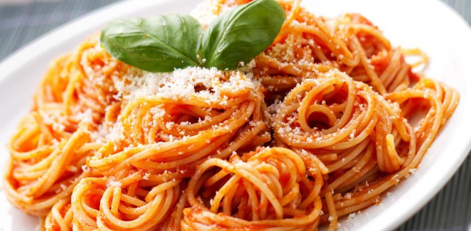
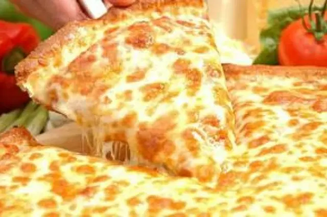
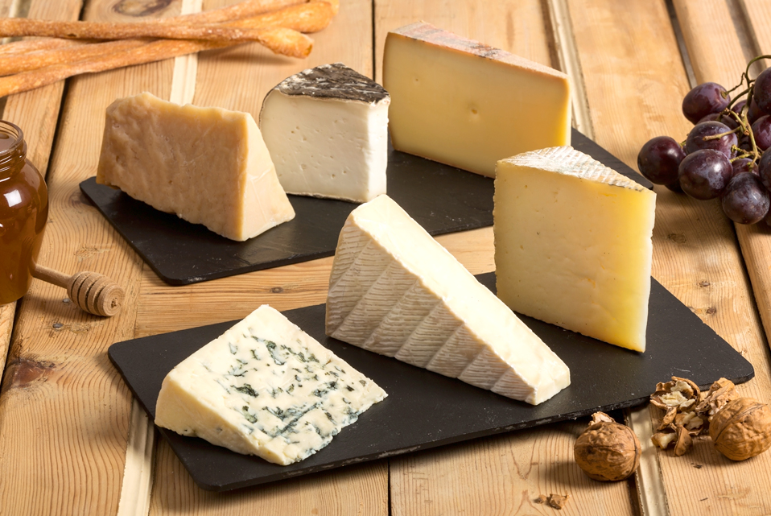
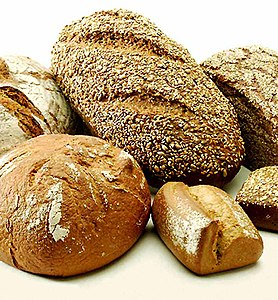

#PASTA

La pasta és un tipus d'aliment elaborat amb una massa, l'ingredient bàsic de la qual és la farina de blat barrejada amb aigua, i a la qual es pot afegir sal, ou o altres ingredients, conformant un producte que generalment es cou en aigua bullent. En la seua elaboració, habitualment s'utilitza l'espècie Triticum durum o blat dur
---
#PIZZA

La pizza és un plat típic de la cuina casolana napolitana, consistent en una base de pa (normalment rodona) amb salsa de tomàquet i formatge (normalment mozzarella) pel damunt. Té marca patentada denominada Specialità Tradizionale Garantita (STG; 'Especialitat Tradicional Garantida'). Atesa la seva popularitat, es calcula que als Estats Units es consumeixen 350 porcions de pizza cada segon.
---
#FORMATGE

El formatge és un aliment fresc o madurat, sòlid o semisòlid, obtingut per separació del sèrum després de la coagulació de la llet sencera, o bé desnatada totalment o parcialment, de la nata, del sèrum d'elaborar mantega o d'una barreja d'alguns o de tots d'aquests productes per l'acció del quall o altres coagulants apropiats, amb hidròlisi prèvia de la lactosa o sense. La llet més habitual a l'entorn de la Unió Europea és la de vaca, ovella, cabra i búfala.

#MOUSSAKA

El pa (del llatí panis) és un aliment bàsic que forma part de la dieta tradicional a Europa, l'Orient Mitjà, l'Índia, l'Amèrica i Oceania. S'acostuma a preparar mitjançant l'enfornament d'una pasterada o massa elaborada fonamentalment amb farina de cereals com el blat, sal i aigua. La barreja, algunes vegades, acostuma a contenir llevats perquè fermenti la massa i sigui més esponjosa i tendra

